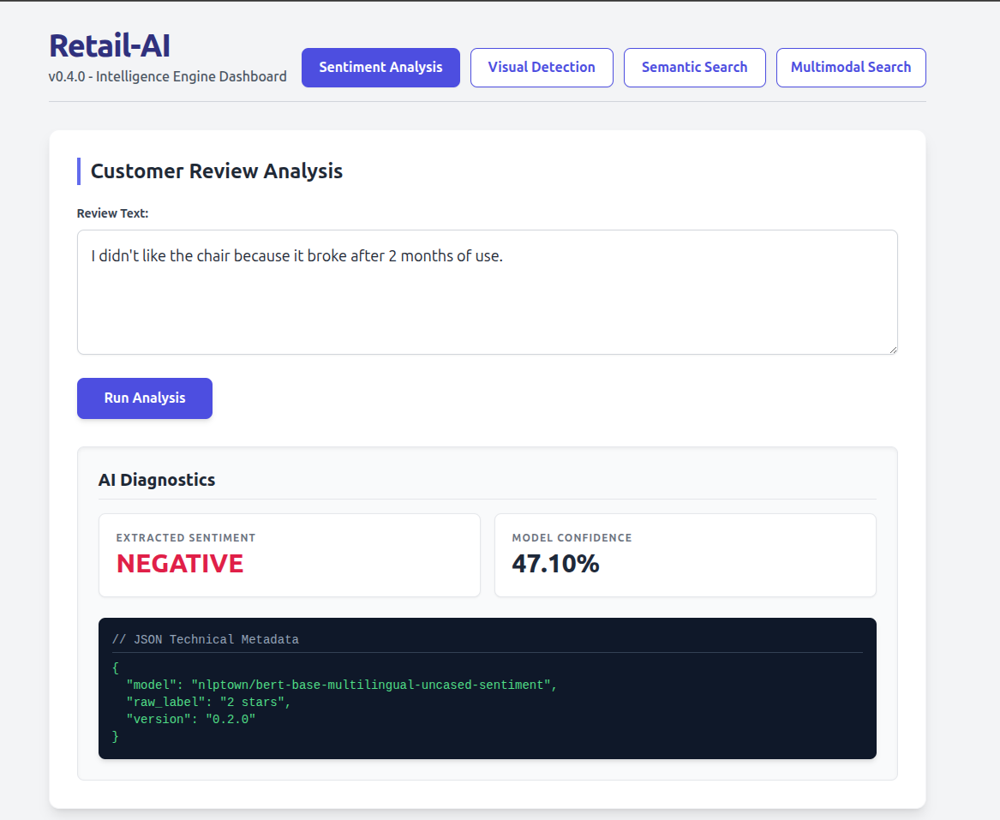
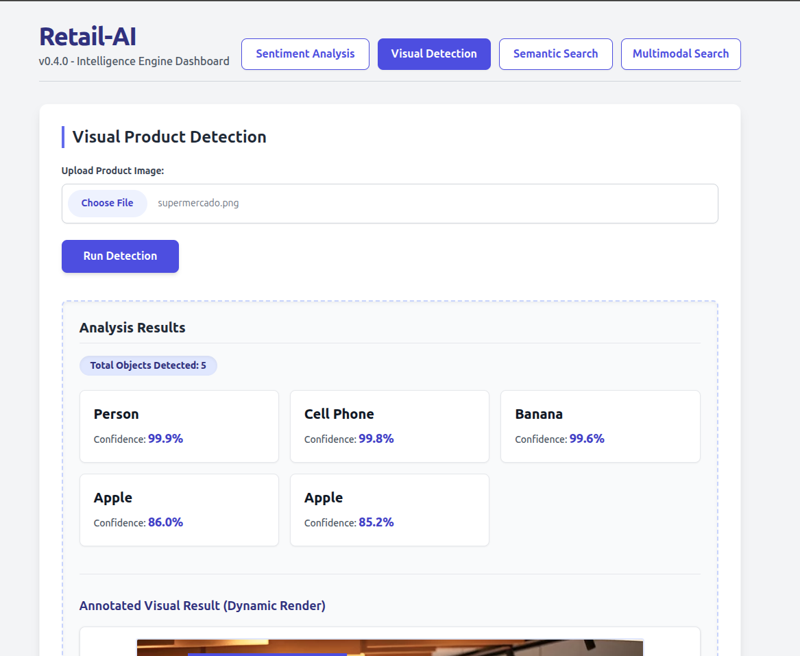
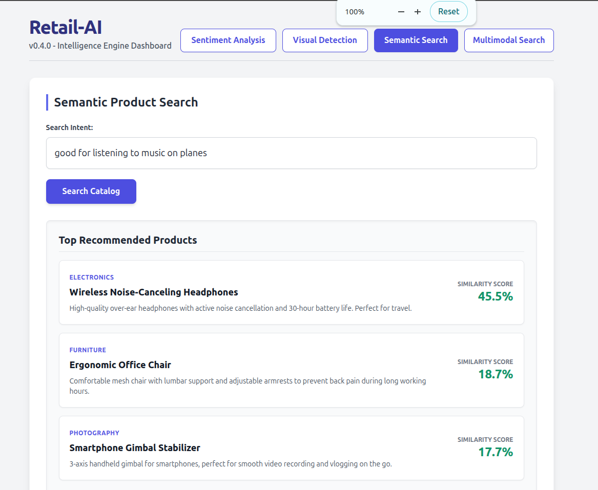
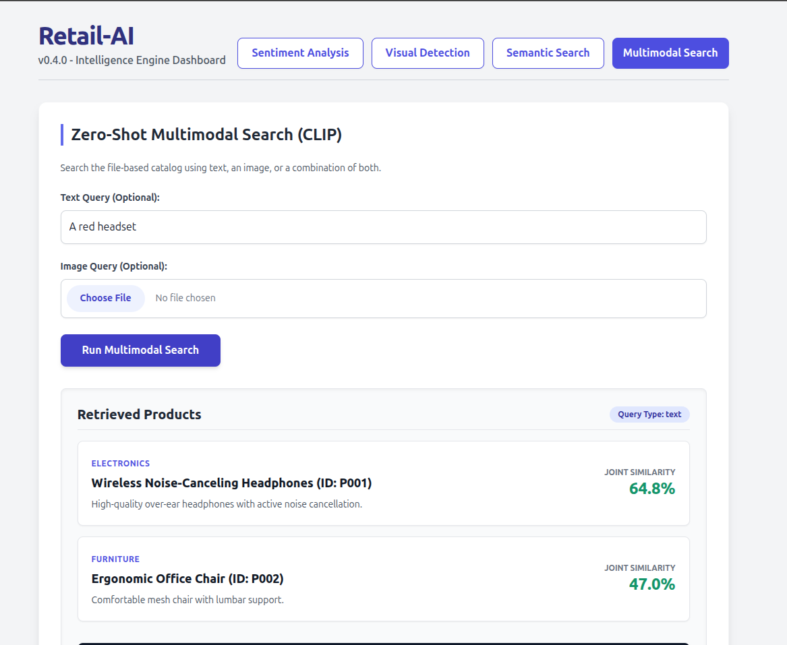

# 🚀 Retail-AI (MLOps FastAPI Template)

[](https://www.python.org/)
[](https://fastapi.tiangolo.com/)
[](https://github.com/MarioCarvalhoBr/retail-ai-mlops-fastapi-template/actions/workflows/ci.yml)
[](https://codecov.io/gh/MarioCarvalhoBr/retail-ai-mlops-fastapi-template)
[](https://opensource.org/licenses/MIT)
[](https://github.com/psf/black)

   

This repository provides a production-grade template for serving Machine Learning models using **FastAPI**, tailored for E-commerce intelligence (**Retail-AI**). The project focuses on rigorous Software Engineering patterns applied to MLOps, including clean architecture, automated testing, performance monitoring, and real-time frontend integration.

## 📋 Table of Contents
- [🚀 Retail-AI (MLOps FastAPI Template)](#-retail-ai-mlops-fastapi-template)
  - [📋 Table of Contents](#-table-of-contents)
  - [🌟 Overview](#-overview)
  - [📸 Dashboard Preview](#-dashboard-preview)
    - [To see the full set of screenshots and detailed explanations of each dashboard feature, please refer to the SCREENSHOTS.md file in the repository.](#to-see-the-full-set-of-screenshots-and-detailed-explanations-of-each-dashboard-feature-please-refer-to-the-screenshotsmd-file-in-the-repository)
  - [🗺️ Project Roadmap](#️-project-roadmap)
  - [🛠 Technologies Used](#-technologies-used)
  - [📂 Project Structure](#-project-structure)
  - [⚙️ Installation and Configuration](#️-installation-and-configuration)
    - [Prerequisites](#prerequisites)
    - [Step by Step](#step-by-step)
  - [🚀 Usage and Execution](#-usage-and-execution)
    - [Starting the Backend - Dockerized:](#starting-the-backend---dockerized)
    - [Running via Docker (Production Recommended)](#running-via-docker-production-recommended)
    - [CI/CD \& Production Distribution](#cicd--production-distribution)
    - [Starting the Backend - Manually:](#starting-the-backend---manually)
    - [Running the Frontend Dashboard](#running-the-frontend-dashboard)
  - [🛒 Managing the Product Catalog (Multimodal Search)](#-managing-the-product-catalog-multimodal-search)
    - [Directory Structure](#directory-structure)
    - [How to Add a New Product](#how-to-add-a-new-product)
  - [🧪 Code Quality and Tests](#-code-quality-and-tests)
  - [📈 Load Testing](#-load-testing)
  - [⚠️ Common Errors and Troubleshooting](#️-common-errors-and-troubleshooting)
    - [Docker Network / `iptables` Error](#docker-network--iptables-error)
  - [📄 License](#-license)
  - [👥 Authors](#-authors)

---

## 🌟 Overview

Unlike isolated research scripts, this project implements a robust **Service Layer** that isolates the inference logic from the web framework. The architecture follows the `src/` layout, ensuring the source code is testable, modular, and ready for horizontal scalability in cloud environments or containers. It seamlessly integrates open-source Hugging Face models for NLP (Sentiment Analysis), Computer Vision (Object Detection), and Zero-Shot Multimodal Retrieval directly into a reactive web dashboard.

---

## 📸 Dashboard Preview

Below is a preview of the Retail-AI MLOps Dashboard in action. *(Replace the placeholder image paths with your actual screenshot files).*

<div align="center">
  
  
  <br>
  
  
</div>

### To see the full set of screenshots and detailed explanations of each dashboard feature, please refer to the [SCREENSHOTS.md](SCREENSHOTS.md) file in the repository.

---

## 🗺️ Project Roadmap

- [x] **v0.1.0 - Foundation:** FastAPI setup, Clean Architecture, Pydantic V2 validation, Pytest, Locust load testing, and basic CI/CD.
- [x] **v0.2.0 - Retail-AI Sentiment:** Integration with Hugging Face (`nlptown/bert-base-multilingual-uncased-sentiment`), offline mode caching, GPU hardware acceleration, and initial Vue.js Frontend.
- [x] **v0.3.0 - Vision Service:** Object detection using `facebook/detr-resnet-50`, multipart image uploads, and interactive bounding box rendering using HTML5 `<canvas>`.
- [x] **v0.4.0 - Retrieval Service:** Semantic Search System using Sentence Embeddings (`sentence-transformers/all-MiniLM-L6-v2`) and in-memory cosine similarity matching.
- [x] **v0.5.0 - Multimodal Search:** True zero-shot cross-modal retrieval mapping text and images to a joint vector space using CLIP (`openai/clip-vit-base-patch32`), backed by a physical file-based product catalog.
- [x] **v0.6.0 - Testing and Performance:** Comprehensive unit and integration tests, code coverage reporting, and Locust load testing to validate API performance under concurrent pressure.
- [x] **v0.7.0 - CI/CD and Dockerization:** GitHub Actions workflows for automated testing, code quality checks, and production-ready Docker configuration with model caching for seamless deployment.
- [x] **v0.8.0 - Deploy Docker Image to Docker Hub:** Publish the containerized AI engine to Docker Hub for easy distribution and deployment across various environments.
- [x] **v0.9.0 - Documentation and Cleanup:** Finalize README with detailed instructions, add inline code comments, and ensure all documentation is clear and comprehensive for users and contributors.
- [x] **v1.0.0 - Stable Release:** Mark the project as stable and ready for production use, with all features implemented, tested, and documented.
---

## 🛠 Technologies Used

The project integrates the most modern tools of the Python and Web ecosystem for MLOps:

* **[FastAPI](https://fastapi.tiangolo.com/):** High-performance web framework for building APIs.
* **[Hugging Face Transformers](https://huggingface.co/docs/transformers/index):** State-of-the-art open-source models for NLP, CV, and Multimodal tasks.
* **[Vue.js 3](https://vuejs.org/) & [Tailwind CSS](https://tailwindcss.com/):** Reactive frontend dashboard for real-time AI interaction via CDN.
* **[Pydantic V2](https://docs.pydantic.dev/):** Data validation and configuration management via environment variables (Security by Design).
* **[Poetry](https://python-poetry.org/):** Dependency management and deterministic virtual environments.
* **[Pytest](https://docs.pytest.org/) & [Locust](https://locust.io/):** Unit/integration testing suite and latency/RPS load testing.

---

## 📂 Project Structure

The organization follows the principle of separation of concerns:

```text
retail-ai-mlops-fastapi-template/
├── data/
│   └── catalog/                # Physical database for the Multimodal Search
├── frontend/                   # Vue.js 3 + Tailwind CSS Dashboard
│   └── index.html              # Reactive UI for API interaction
├── src/                        # Application source code
│   ├── api/                    # FastAPI Routes and Endpoints
│   ├── config/                 # Configuration management (Settings/Pydantic)
│   ├── core/                   # Core components (Logger, etc.)
│   ├── models/                 # ML Models abstraction (Hugging Face Wrappers)
│   ├── services/               # Business and inference logic orchestration
│   ├── utils/                  # Helper functions
│   └── main.py                 # Application entry point
├── tests/                      # Automated test suite
├── .github/workflows/          # GitHub Actions CI/CD pipelines (Auto Releases)
├── configs/                    # YAML configuration files
├── Makefile                    # Automation of common tasks
├── pyproject.toml              # Project dependencies and metadata
└── setup_env.sh                # Environment bootstrapping script
```

---

## ⚙️ Installation and Configuration

### Prerequisites
* Python 3.12+
* Poetry installed (`pip install poetry`)

### Step by Step

1.  **Clone the Repository:**
    ```bash
    git clone [https://github.com/MarioCarvalhoBr/retail-ai-mlops-fastapi-template.git](https://github.com/MarioCarvalhoBr/retail-ai-mlops-fastapi-template.git)
    cd retail-ai-mlops-fastapi-template
    ```

2.  **Environment Setup:**
    The setup script will create the virtual environment and install dependencies:
    ```bash
    chmod +x setup_env.sh
    ./setup_env.sh
    ```
    
    *Alternatively*, you can install the dependencies manually using Poetry. You can choose to install in CPU mode (default) or GPU mode:
    ```bash
    # Install dependencies for CPU mode
    poetry install --with cpu
    
    # Or, install dependencies for GPU mode
    poetry install --with gpu
    ```

3.  **Environment Variables:**
    Configure your `.env` file (created automatically from `.env.example`). Toggle `HF_HUB_OFFLINE=1` to enforce offline execution if the AI models are already cached in your environment.

---

## 🚀 Usage and Execution
### Starting the Backend - Dockerized:
### Running via Docker (Production Recommended)
The entire AI engine can be containerized and run with a single command. The Docker configuration automatically persists your product catalog and caches the heavy Hugging Face models so they are downloaded only once.

You can run the Docker container in two modes: CPU (default) or GPU.

**Running in CPU Mode (Default)**
1. Build and start the container in detached mode:
   ```bash
   # First time setup (builds the image and starts the container)
   docker-compose up -d --build

   # Subsequent runs (faster startup since the image is already built and models are cached)
   docker-compose up -d
   ```

**Running in GPU Mode**
If you have an NVIDIA GPU and want to leverage hardware acceleration, you can build the image with the GPU dependencies:
1. Build and start the container in detached mode with the `INSTALL_GROUP=gpu` argument:
   ```bash
   # Build the image and start the container in GPU mode
   INSTALL_GROUP=gpu docker-compose up -d --build
   ```

2. Monitor the logs to ensure models are downloading/loading correctly:
   ```bash
   docker-compose logs -f
   ```
3. To stop the engine:
   ```bash
   docker-compose down
   ```
*Note: The frontend can still be accessed by opening `frontend/index.html` locally, as it communicates directly with `localhost:8000` exposed by the container.*

### CI/CD & Production Distribution

The project follows a rigorous DevOps lifecycle. Every official release triggers an automated pipeline that ensures code quality and global availability:

- **Automated Testing**: Runs the full suite of unit and integration tests using `pytest` and `unittest.mock`.
- **Static Analysis**: Enforces strict typing with `MyPy` and code quality with `Flake8`.
- **Container Registries**:
  - **Docker Hub**: Images are automatically built and pushed to `mariocarvalhobr/retail-ai`.
  - **GitHub Container Registry (GHCR)**: Images are also available at `ghcr.io/mariocarvalhobr/mlops-fastapi-template`.
- **Versioning**: Uses Semantic Versioning (SemVer). The `:latest` tag always points to the most recent stable production release.

To pull the production image directly, choose the explicitly tailored version for your hardware:

- **`retail-ai:latest-cpu`** — Lightweight, for your local PC or standard web servers.
- **`retail-ai:latest-gpu`** — Heavyweight, includes NVIDIA drivers and CUDA optimizations for high-performance inference.

**For CPU Mode (Lightweight / Default):**
```bash
  # Download the pre-built CPU image from Docker Hub
  docker pull mariocarvalhobr/retail-ai:latest-cpu
  # OR
  docker pull ghcr.io/mariocarvalhobr/retail-ai-mlops-fastapi-template:latest-cpu

  # Run the container with the CPU image
  docker run -d -p 8000:8000 --name retail_ai_engine mariocarvalhobr/retail-ai:latest-cpu
```

**For GPU Mode (Heavy / High Performance):**
```bash
  # Download the pre-built GPU image from Docker Hub
  docker pull mariocarvalhobr/retail-ai:latest-gpu
  # OR
  docker pull ghcr.io/mariocarvalhobr/retail-ai-mlops-fastapi-template:latest-gpu

  # Run the container providing NVIDIA GPU access
  docker run --gpus all -d -p 8000:8000 --name retail_ai_engine mariocarvalhobr/retail-ai:latest-gpu
```

### Starting the Backend - Manually:
To start the FastAPI development server with *hot-reload*:

```bash
poetry run uvicorn src.main:app --reload
```

The API will be available at `http://localhost:8000`. Access the interactive Swagger UI documentation at `http://localhost:8000/docs`.

### Running the Frontend Dashboard
The frontend is built as a lightweight, reactive Single Page Application (SPA). No Node.js or npm installation is required!

1. Ensure the FastAPI backend is running and healthy.
2. Open the `frontend/index.html` file in your favorite web browser.
3. Navigate between the tabs to interact with the AI models in real-time.

---

## 🛒 Managing the Product Catalog (Multimodal Search)

Starting from **v0.5.0**, the system uses a physical directory structure to load products and compute joint vector embeddings via the CLIP model.

### Directory Structure
The catalog must be located at `data/catalog/`. Each product requires its own unique folder containing an `info.json` metadata file and an `images/` subfolder.

```text
data/
└── catalog/
    ├── P001/
    │   ├── info.json
    │   └── images/
    │       ├── front_view.jpg
    │       └── side_view.png
    ├── P002/
    │   ├── info.json
    │   └── images/
    │       └── product_shot.webp
```

### How to Add a New Product
To seamlessly add a new product to the AI engine:

1. **Create a Folder:** Navigate to `data/catalog/` and create a new directory with a unique Product ID (e.g., `P003`).
2. **Add Metadata:** Inside the new folder, create a file named `info.json` following this exact structure:
   ```json
   {
       "id": "P003",
       "name": "Leather Messenger Bag",
       "category": "Accessories",
       "description": "Handcrafted genuine leather messenger bag with laptop compartment."
   }
   ```
3. **Add Images:** Create a subfolder named `images/` inside your product directory. Drop as many product pictures as you want inside it. Supported modern formats include: `.jpg`, `.jpeg`, `.png`, `.webp`, and `.avif`.
4. **Restart the API:** The engine automatically scans the `data/catalog` folder upon startup, calculates the multimodal embeddings for texts and images, and loads them into the active tensor memory.

---

## 🧪 Code Quality and Tests

The project uses a `Makefile` to standardize development commands.

```bash
make test        # Runs all tests (Unit + Integration)
make format      # Applies Black and isort
make lint        # Checks compliance with flake8
```

---

## 📈 Load Testing

To validate how the API behaves under concurrent pressure:

1. Ensure the backend API is running in one terminal.
2. In another terminal, execute: `make load-test`
3. Access `http://localhost:8089` to configure the number of simulated users and observe real-time latency graphs.


---

## ⚠️ Common Errors and Troubleshooting

### Docker Network / `iptables` Error

If you encounter errors related to `iptables` or network creation when running `docker-compose up -d` (for example, `Chain 'DOCKER-ISOLATION-STAGE-2' does not exist`), it means the host OS rules were flushed or reloaded and Docker lost its networking chains.

**Solution 1: Restart Docker Daemon**  
Usually, just restarting the service forces Docker to recreate its chains:
```bash
sudo systemctl restart docker
```

**Solution 2: Flush and Rebuild iptables**  
If the above doesn't work, clear the filter tables explicitly before restarting:
```bash
sudo iptables -t filter -F
sudo iptables -t filter -X
sudo systemctl restart docker
```

**Solution 3: Switch to iptables-legacy (Linux specific)**  
If your system is using `nftables` and conflicting with Docker, you can revert to legacy `iptables`:
```bash
sudo update-alternatives --set iptables /usr/sbin/iptables-legacy
sudo systemctl restart docker
docker-compose up -d
```

---

## 📄 License
This project is licensed under the MIT License - see the [LICENSE](LICENSE) file for details.

---

## 👥 Authors
- **Mário de Araújo Carvalho** - *Contributor and Developer* - [GitHub](https://github.com/MarioCarvalhoBr)
