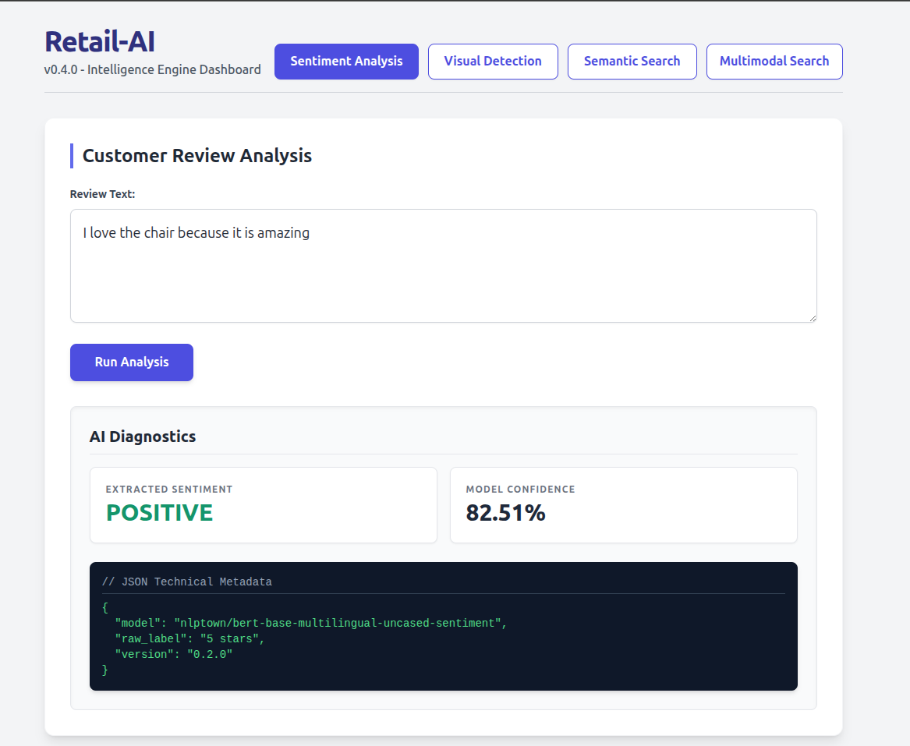
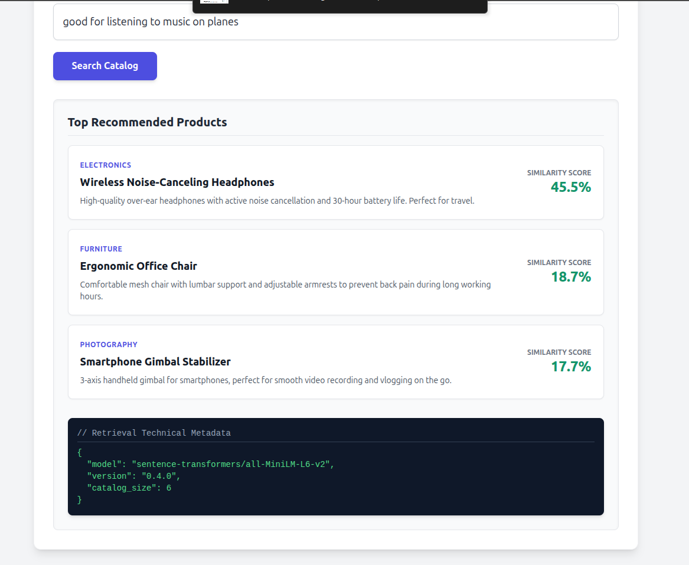
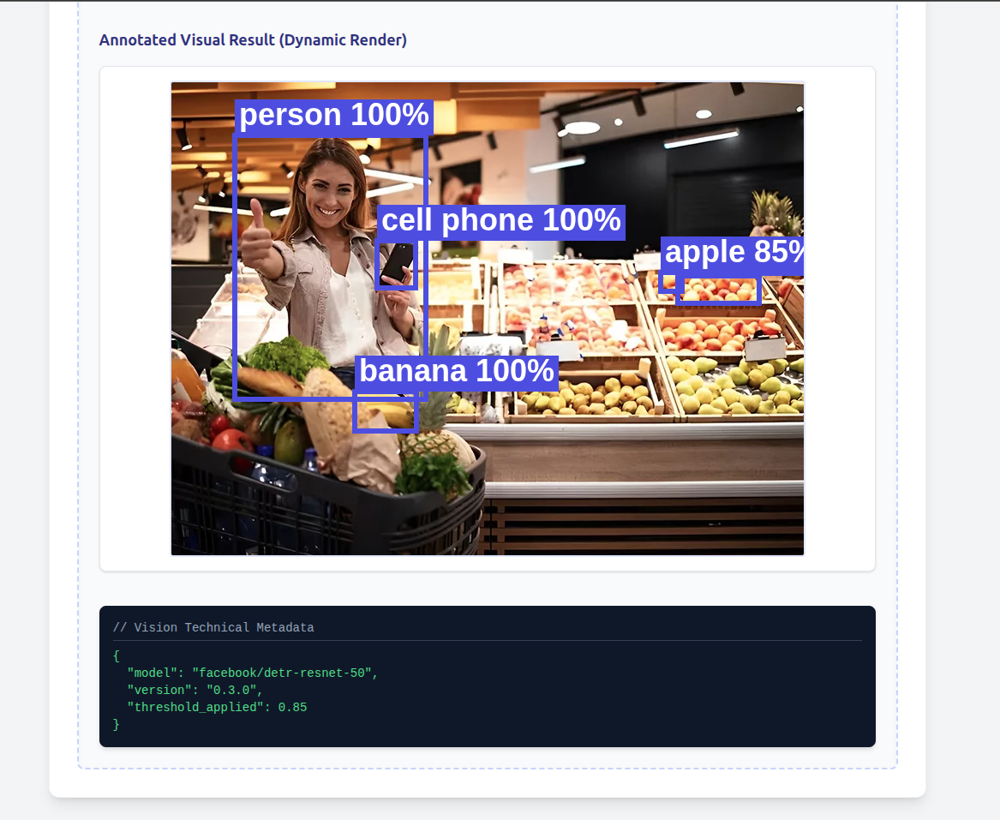
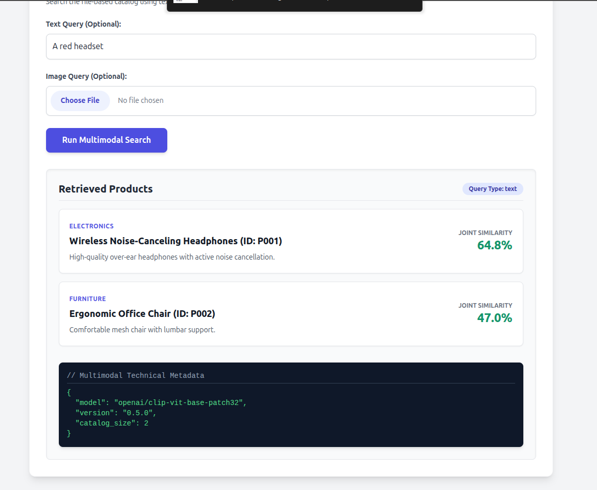
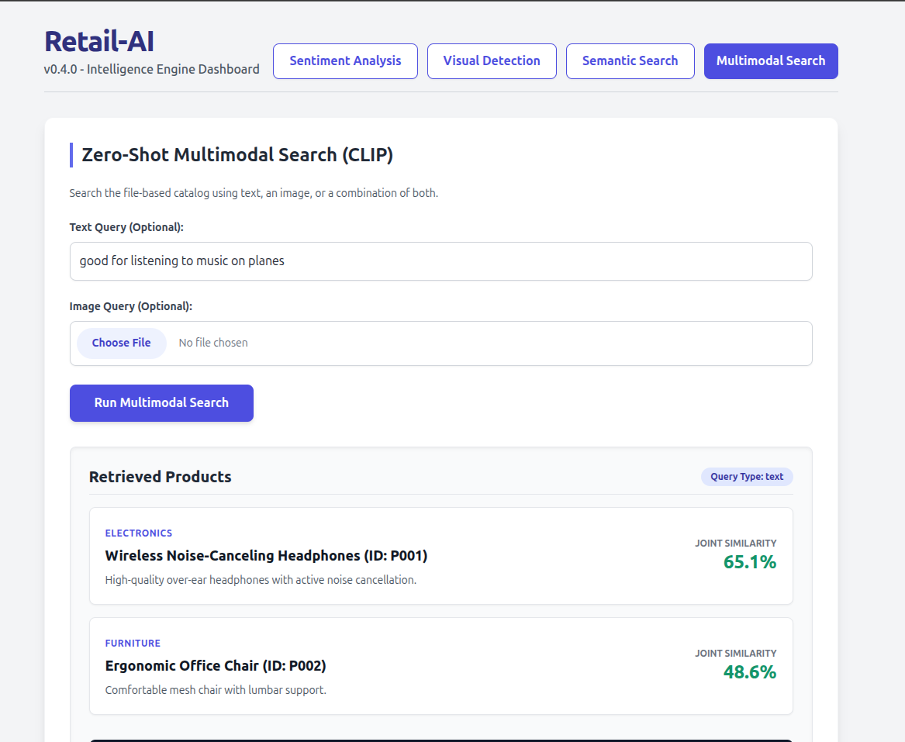
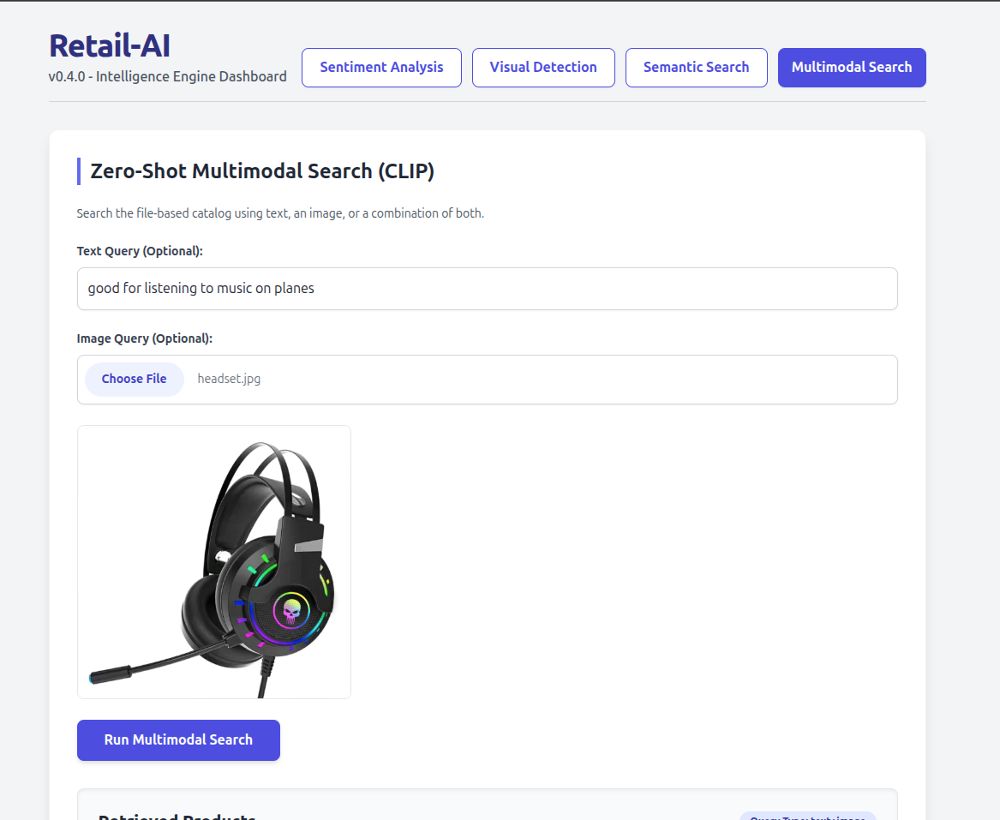
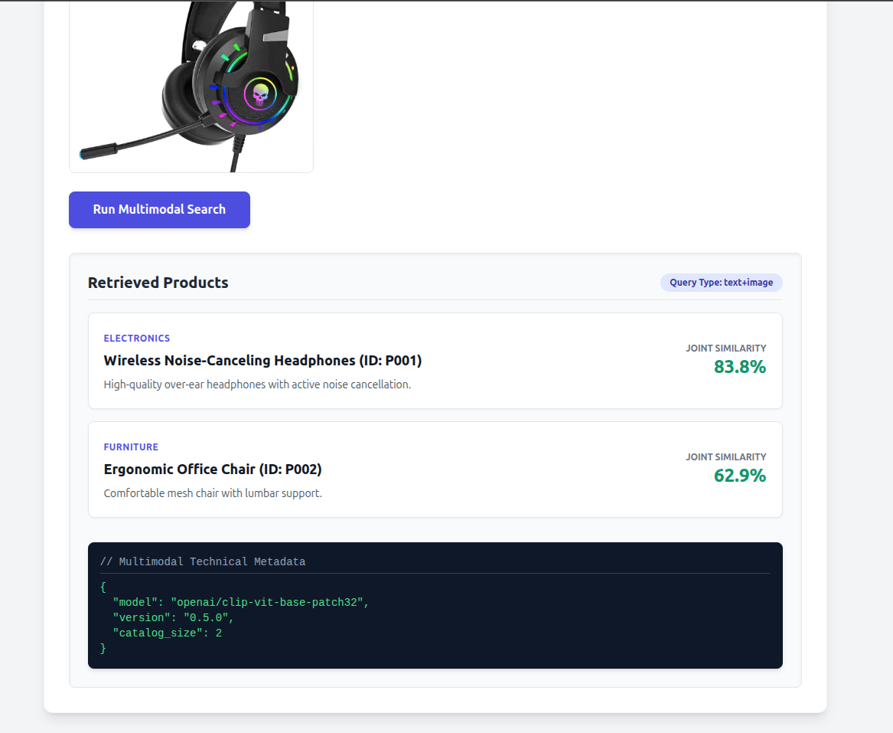

# 📸 Retail-AI: MLOps Dashboard Showcase

Welcome to the visual tour of the **Retail-AI Intelligence Engine**. This document provides a comprehensive look at our reactive frontend dashboard, designed to interact seamlessly with our high-performance FastAPI backend and Hugging Face AI models. 

Below you will find captures of our system's core capabilities, demonstrating how we bridge the gap between advanced Machine Learning models and tangible e-commerce business value.

---

## 1. Customer Review Analysis (NLP)

This module leverages the `nlptown/bert-base-multilingual-uncased-sentiment` model to perform real-time sentiment analysis on product reviews. It maps customer feedback to a business-oriented sentiment (Positive, Neutral, Negative) and outputs the model's exact confidence score, handling multiple languages natively.

<table width="100%">
  <tr>
    <td width="50%">
      
       <em>Fig 1.1: Standard positive review inference and JSON metadata output.</em>
    </td>
    <td width="50%">
      
       <em>Fig 1.2: Handling negative feedback with confidence metrics.</em>
    </td>
  </tr>
</table>

---

## 2. Semantic Product Search (Retrieval Service)

Moving beyond traditional lexical search (keyword matching), our Retrieval Service uses the `sentence-transformers/all-MiniLM-L6-v2` model to understand customer intent. It computes dense vector embeddings and uses cosine similarity to rank products from our in-memory catalog, ensuring highly relevant recommendations.

<table width="100%">
  <tr>
    <td width="50%">
      
       <em>Fig 2.1: Intent-based search queries matching product semantics.</em>
    </td>
    <td width="50%">
      
       <em>Fig 2.2: Similarity scores ranking the catalog dynamically.</em>
    </td>
  </tr>
</table>

---

## 3. Visual Product Detection (Computer Vision)

Our Computer Vision module utilizes the `facebook/detr-resnet-50` architecture for End-to-End Object Detection. The backend identifies products in uploaded images, applies a strict business confidence threshold (85%), and the Vue.js frontend dynamically renders annotated bounding boxes and labels directly onto an HTML5 Canvas.

<table width="100%">
  <tr>
    <td width="50%">
      
       <em>Fig 3.1: Image upload and high-confidence object identification.</em>
    </td>
    <td width="50%">
      
       <em>Fig 3.2: Dynamic HTML5 Canvas rendering bounding boxes locally.</em>
    </td>
  </tr>
</table>

---

## 4. Zero-Shot Multimodal Search (CLIP Fusion)

The crown jewel of our v0.5.0 architecture. This module employs the `openai/clip-vit-base-patch32` model to map both textual intent and visual features into a shared, joint vector space. Users can search our file-based catalog using text, an image, or a late-fusion combination of both to achieve unprecedented search accuracy.

<table width="100%">
  <tr>
    <td width="50%">
      
       <em>Fig 4.1: Cross-modal retrieval using only textual intent.</em>
    </td>
    <td width="50%">
      
       <em>Fig 4.2: Visual search mapping an uploaded image to the catalog.</em>
    </td>
  </tr>
  <tr>
    <td width="50%">
      
       <em>Fig 4.3: Late-fusion search combining text and image vectors.</em>
    </td>
    <td width="50%">
      
       <em>Fig 4.4: Technical metadata showing the fusion strategies applied.</em>
    </td>
  </tr>
  <tr>
    <td width="50%">
      
       <em>Fig 4.5: Handling edge cases and low-similarity fallbacks gracefully.</em>
    </td>
    <td width="50%">
      </td>
  </tr>
</table>

---

## 📄 License
This project is licensed under the MIT License - see the [LICENSE](LICENSE) file for details.

---

## 👥 Authors
- **Mário de Araújo Carvalho** - *Contributor and Developer* - [GitHub](https://github.com/MarioCarvalhoBr)
